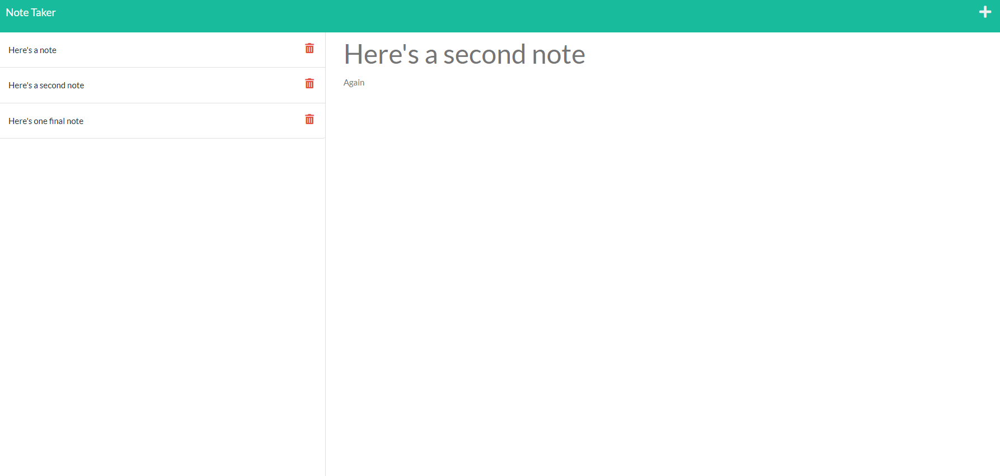

# Note Taker
  

  ## Description

  The application is designed to take input from the user for a note's title and body, and save it to a json file. The note is given a unique ID, and the ID, title, and text are written to a json file.
  
  The application also includes a delete function to delete notes. The delete function matches the id of the note clicked with the id within the json file, and removes it from the file before rewriting the new array to the file.

## Table of Contents

- [Installation](#installation)
- [Usage](#usage)
- [License](#License)
- [Contributing](#contributing)
- [Tests](#tests)
- [Questions](#questions)
- [Screenshots](#screenshots)
- [Links](#links)

  ## Installation

  The application requires express.js to run locally.

  ## Usage

  After running npm install, run npm start from the command line and access through the local host. Alternatively, use the Heroku link provided below.

  ## License

  This project is licensed under the GNU GPLv3 license. Read more about the license here:
  https://choosealicense.com/licenses/gpl-3.0/
  

  ## Contributing

  Please fork and submit a pull request.

  ## Tests

  Test using a variety of inputs.

  ## Questions

  You can reach me at GitHub; my username is nathanh635 and my profile is here: https://github.com/nathanh635. 
  You can also email me at nathanh635@gmail.com. 
  
    ## Screenshots

  Below is a screenshot of the deployed page.

  
## Links

  Repository: https://github.com/nathanh635/NoteTaker
  
  Heroku Deployment: https://fathomless-dawn-24182.herokuapp.com/notes

